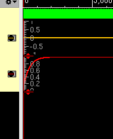

# Model-of-photodiode-using-RNM

### Comando para configurar Cadence usando **Makefile**

A continuación se muestra la simulación del modelaod de un fotodiodo.


```bash for synopsys
setenv GIT_ROOT `git rev-parse --show-toplevel`
setenv UVM_WORK $GIT_ROOT/work/uvm
mkdir -p $UVM_WORK && cd $UVM_WORK
ln -sf $GIT_ROOT/hw/Makefile/Makefile.xrun Makefile
```

``` bash for vivado
export GIT_ROOT=$(git rev-parse --show-toplevel)
export UVM_WORK="$GIT_ROOT/work/uvm"
mkdir -p work/uvm && cd work/uvm
ln -sf $GIT_ROOT/hw/Makefile/Makefile.vivado Makefile 
```

### Makefile
Despues de hacer los pasos anterior para tener el entorno de Trabajo, puedes utilizar ahora el makefile:
- make compile : Te servira para compilar y ver los resultados
- make run: Te ayurara para compilar, ver los resultados y ver la interfaz gráfica

Y si tienes dudas, puedes colocar make var o make help :)


